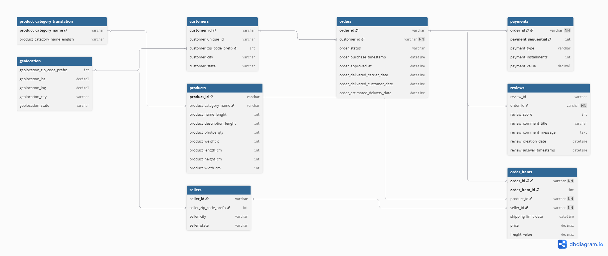

# FIAP - Data Analytics | Fase 1  
## Análise Logística e Desigualdade Regional - Olist

---

## Objetivo

Este projeto tem como objetivo analisar o desempenho logístico de um e-commerce brasileiro (Olist), com foco na relação entre tempo de entrega, custo logístico e experiência do cliente.

---

## Fonte dos Dados

Os dados utilizados neste projeto são provenientes do dataset público da Olist, disponibilizado na plataforma Kaggle:

🔗 [Dataset Olist no Kaggle](https://www.kaggle.com/datasets/olistbr/brazilian-ecommerce)

O dataset contém informações sobre pedidos, clientes, produtos, vendedores, pagamentos, avaliações e geolocalização.

---

## Etapas do Projeto

---

### 1. Entendimento do Modelo de Dados

Inicialmente foi realizado o mapeamento do modelo relacional original do dataset, identificando as principais tabelas e suas relações:

- orders  
- customers  
- order_items  
- products  
- sellers  
- payments  
- reviews  
- geolocation  

---

### 2. Limpeza e Preparação dos Dados

A base foi tratada e consolidada em um único dataset analítico.

#### Principais transformações realizadas:

- Junção das tabelas (`merge`) para construção de uma base única  
- Conversão de colunas de data para formato datetime  
- Criação de colunas derivadas:
  - `order_date`  
  - `dif_deliv_estimat_days` (diferença entre entrega real e estimada)  
  - `dif_deliv_compra_days` (tempo total de entrega)  
- Integração com tabela de regiões (estado → região)  
- Remoção de duplicidades  
- Tratamento de valores nulos  
- Seleção apenas das colunas relevantes para análise  

#### Filtro aplicado:

A análise foi focada em:

- Período específico (2017–2018)

---

### 3. Construção da Base Analítica Consolidada

Após o entendimento do modelo relacional original, as principais tabelas do dataset foram integradas em uma única base analítica para facilitar a análise exploratória no Google Colab.

A base consolidada foi construída a partir de joins entre pedidos, pagamentos, clientes, itens do pedido, produtos, avaliações e regiões.

---

### 4. Tecnologias Utilizadas

- Python  
- Pandas  
- Google Colab  
- Matplotlib  
- Seaborn  
- Git  
- GitHub  
